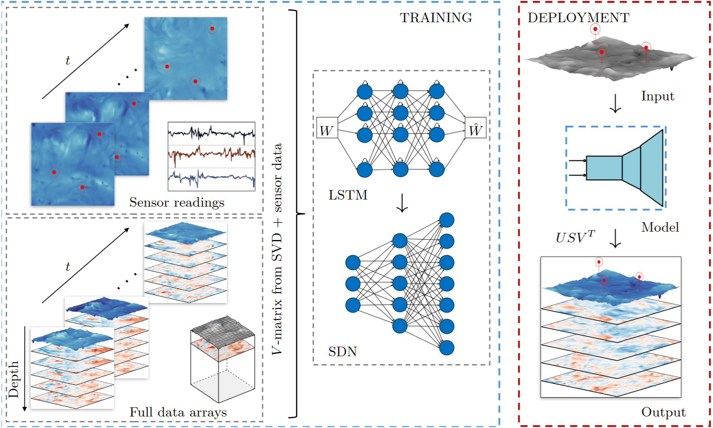

# SHRED-turbulence-sensing
Mapping surface height dynamics to flow physics in free-surface turbulent flow using the SHRED neural network algorithm

Code and notebooks for SHRED (SHallow REcurrent Decoder) applied to free-surface turbulence: reconstructing subsurface velocity fields from sparse surface-height sensors, with comparisons across DNS and laboratory (T-Tank) data.

This repo accompanies:
“Mapping surface height dynamics to subsurface flow physics in free-surface turbulent flow using a shallow recurrent decoder” (in submission).
Preprint: link • Archived code snapshot (Zenodo DOI): to be added

# Overview
### Goal: 
infer subsurface turbulence velocity fields from 3 surface sensor points capturing the time series of the surface elevation, in two turbulent DNS cases (S1 & S2), and two cases of experimental cases (E1 & E2) from a turbulent water tank (T-tank).

### Method 
We apply the SHallow REcurrent Decoder (SHRED), which combines an LSTM (temporal encoder) with a shallow decoder (spatial mapping). We train in a compressed SVD basis to ease the training while keeping the relevant turbulence. Figure below shows the general outline. 

We input time series of surface elevation from three randomly placed surface sensor points into a two-layer LSTM. The LSTM encodes these input sequences into a latent representation of their temporal dynamics. This latent vector is then passed to a shallow decoder network (SDN), which maps it onto the velocity fields across depth. We do this in compressed space, by feeding into the SDN the compressed V matrices of the SVD decomposition for the surface elevation and the subsurface velocity fields. These fields are used in training and validation not to learn the subsurface time dynamics but only to learn the mapping of the surface time dynamics onto the subsurface fields.

We quantify the reconstruction errors using five metrics:
- Comparison of planar RMS values of the velocity from (uncompressed) ground truth and reconstructed fields
- Normalized Mean Squared Error (NMSE) of reconstruction fields as compared to (uncompressed) ground truth
- Power Spectral Density Error (PSDE) of spectra calculated from reconstructed turbulent fields, as compared to (uncompressed) ground truth
- Structural Similarity Measure Index (SSIM) of reconstructed fields as compared to (uncompressed) ground truth
- Peak Signal-to-Noise Ratio (PSNR) of reconstructed fields as compared to (uncompressed) ground truth

Details about the error metrics can be found in the manuscript. The functions that calculate these can be found in 'Processdata.py'. 

### Data 
DNS cases S1/S2 and experimental T-Tank (Note: sometimes called Teetank internally in code) cases E1/E2. Details about the turbulence statistics can be found in the manuscript.  

Note that the specific case names for S1, S2, E1 and E2 differ in the code. For the DNS data, it is based on the Reynolds number of the simulation. Case S1 = "RE1000", case S2 = "RE2500". For the experimental cases, the names are sometimes based on the mode setting on the nozzles for the turbulent injection flow in the T-tank. Case E1 = "P25" and case E2 = "P50". In any case, the second case is always the more turbulent data. Note that the Reynolds numbers for the experimental cases are significantly higher than for the DNS cases.

### Outputs
Plots for manuscript are generated in 'Run turbulence sensing SHRED.ipynb'. This include plots for
- SVD modes for DNS and experiments (Fig. 3-4)
- Loss profile during SHRED training (Fig. 5)
- Comparison of test data snapshots of ground truth, compressed fields and SHRED reconstruction (Fig. 6-7)
- Case-by-case comparison of ground truth and reconstructed instantaneous velocity RMS profiles in depth (Fig. 8)
- Error metric plot for SHRED reconstructions, showing depth-dependence of metrics such as NMSE, PSDE, SSIM & PSNR (Fig. 9)
- Comparison of ground truth vs reconstruction of time series of planar RMS velocity for test snapshots (Fig. 10)
- Comparison of PSD spectra for ground truth, compressed and reconstructed fields for all cases (Fig. 11)
- Analysis of rank-dependence of PSD spectra (Fig. 12, in Appendix A)
- Analysis of rank-dependence of error metrics (Fig. 13, in Appendix A)

# Repository guide

## Scripts
#### main
- Run turbulence sensing SHRED.ipynb — end-to-end demo + figure reproduction.
#### Necessary additional script files
- models.py — SHRED network definition (LSTM + decoder) and training utilities (adapted from pyshred).
- processdata.py — SHRED run wrappers, error metrics (RMS/NMSE/SSIM/PSNR/PSD-error), ensemble averaging, figure-data preparation.
- plot_results.py — high-level plotting: multi-panel layouts, PSD panels with insets, depth profiles, etc.
- utilities.py — data loaders for DNS/T-Tank, mesh/geometry helpers, SVD compute/load, reshaping utilities.
- paths.py — ensures correct paths for each file saved/loaded 

## Folders

- data — folder containing raw velocity and profilometry data for DNS and experiments, as well as SVD  calculations. Folder structure:

  data/

  ├─ DNS/

  │ ├─ raw/     # huge DNS velocity/profilometry files (not in repo)

  │ └─ SVD/     # DNS SVD .mat files (external storage)

  ├─ exp/

  │ ├─ raw/     # experimental raw files (not in repo)

  │ └─ SVD/     # experimental SVD .mat files

- output — folder containing SHRED outputs and error metric calculations. Folder structure:
     
     output/
     
     
     ├─ SHRED/     # SHRED run outputs (V_recons, V_svd, meta)
     
     
     └─ metrics/   # error metrics, summaries, plot

## Data & folder structure
- Raw data (DNS / T-Tank) are not included in the current repository, but can be found and downloaded from the following site [insert link]. Once dowloaded, we assume a folder structure where these are saved in the folders: /data/DNS/raw or /data/exp/raw, located relative to code folder
- SVD decompositions for DNS and experimental planes are essential. These can be calculated from script. Once calculated, we assume a folder structure where these are saved in the folders: /data/DNS/SVD or /data/experiments/SVD, located relative to code folder
- SHRED calculations are saved and stored in /output/SHRED, located relative to code folder
- all error metrics are saved and stored in /output/metrics/, located relative to code folder

# Quickstart overview
1) Download data from [link] and store them in /data/DNS/raw/ and /data/exp/raw.

2) Open Run turbulence sensing SHRED.ipynb and run all cells:

3) Pre-processing:
   - Once downloaded, load  DNS and experimental data from the folder: /data/DNS/raw or /data/exp/raw
   - Convert all data to same format, using .MAT files
   - Calculate (or load, if pre-saved) SVD for velocity fields and save to /data/DNS/SVD or /data/exp/SVD

4) SVD mode decompositon
   - Run plotter for SVD modes and turbulence spectrum

5) Run SHRED
   - Run the main SHRED calculation program. Outputs (V matrix of compressed and reconstruction) are saved to folder /output/SHRED

6) Post-SHRED analysis
   - Calculate depth-dependent error metrics (NMSE, PSDE, SSIM & PSNR) and u_RMS of ground truth and reconstruction, and save outputs to /output/metrics
   - Plot depth-dependend error metrics
   - Calculate and plot instantaneous vertical u_RMS profiles and save calculations to /output/metrics
   - Calculate and plot a chosen error metric time series
   - Calculate and plot PSD spectra for all cases (assumes 2 DNS and 2 experimental) for a chosen depth
   - Calculate, save and plot parametric analysis of rank-dependence of error metrics and PSD spectra. Calculations saved to /output/metrics.

 

# Installation
bash
Copy
Edit

### with conda (recommended)
conda env create -f environment.yml
conda activate shred-env

### with pip
python -m venv .venv
source .venv/bin/activate     # (Windows: .venv\Scripts\activate)
pip install -r requirements.txt
Core deps: numpy, scipy, matplotlib, torch, h5py, scikit-image, cmocean, tqdm.

# Citing
If you use this code, please cite the paper and the archived code as follows:

TBD

# Acknowledgements
Code is based on the original SHRED code base, and the first paper on this method by Williams et al (2024): https://doi.org/10.1098/rspa.2024.0054

Original SHRED Code base: https://github.com/Jan-Williams/pyshred

